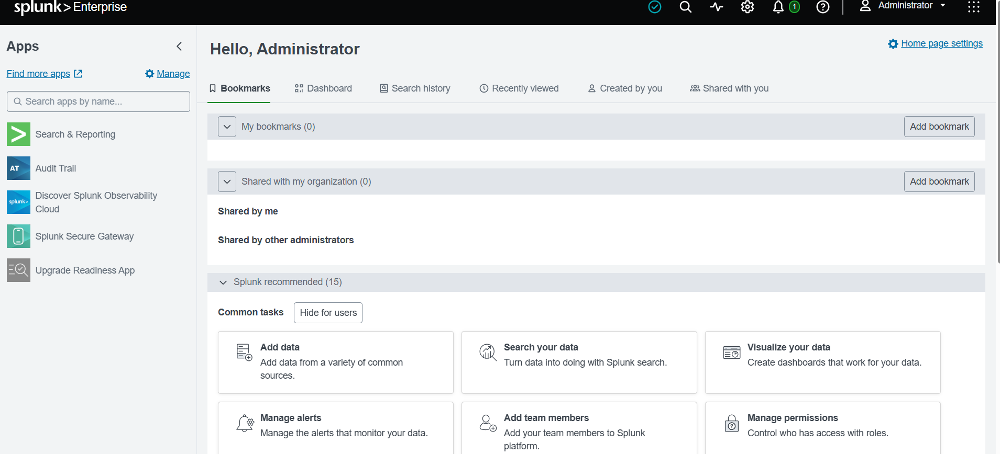
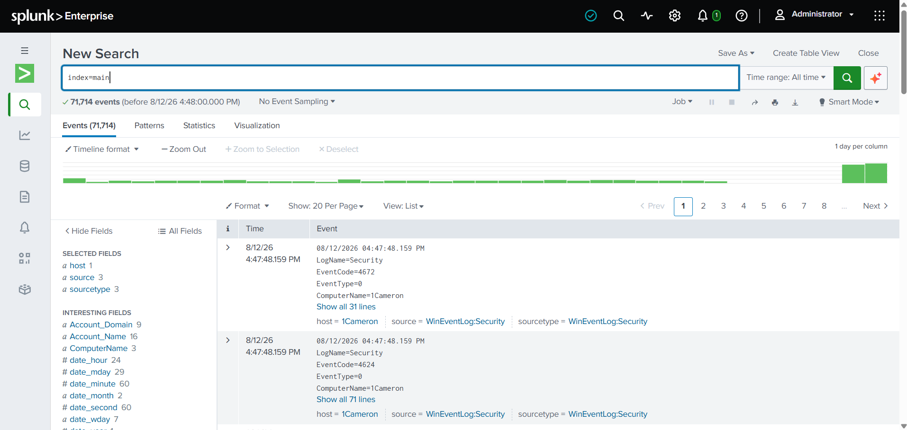
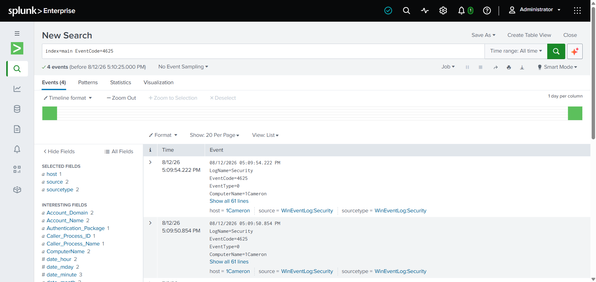
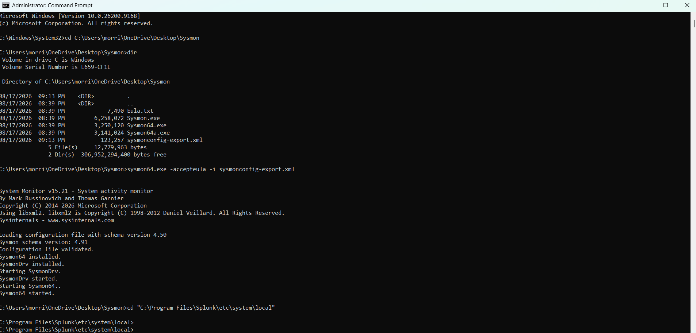
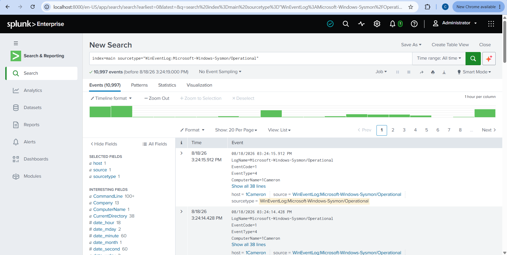

# Cybersecurity Home Lab

## Overview
Personal cybersecurity home lab built on an HP Pavilion x360 (Intel i5, 8GB RAM) running VirtualBox. This is an ongoing project where I'm simulating a small enterprise environment to get hands-on practice and build real skills for help desk and SOC analyst roles.

## Environment
- Host Machine: HP Pavilion x360 (Intel i5-1135G7, 8GB RAM, Windows 11 Home)
- Virtualization Platform: Oracle VirtualBox 7.2
- VM Storage Location: C:\HomeLab (local drive, outside OneDrive)

## Why VirtualBox?
I went with VirtualBox because it's free, open source, and runs well on Windows. It also supports pre-built VM images, which made it the easiest option for a home lab on a personal laptop without spending extra money.

---

## Phase 1: Virtual Machine Setup 

### Overview
The goal of Phase 1 was to get the foundation of my home lab up and running. That meant setting up a virtualization platform and installing two virtual machines, Kali Linux and Ubuntu Server. This gives me multiple systems to work with like a real network, which everything else in the lab builds on.

### Virtual Machines Deployed

**Kali Linux 2026.2**
- **Purpose:** My main machine for security testing and attacks. Kali is the standard pentesting distro and comes with most of the tools I need already installed.
- **RAM Allocated:** 2048 MB
- **Storage:** 80GB virtual disk
- **Configuration:** Imported the pre-built VirtualBox image straight from kali.org
- **Post-install steps:**
  - Updated the system with `sudo apt update && sudo apt upgrade -y`
  - Changed the default password right away for basic security

**Ubuntu Server 26.04 LTS**
- **Purpose:** Simulates a server environment so I can practice Linux administration, networking, and later Active Directory integration.
- **RAM Allocated:** 2048 MB
- **Storage:** 25GB virtual disk
- **Configuration:** Installed from the ISO using the guided storage layout with LVM
- **Post-install steps:**
  - Updated the system with `sudo apt update && sudo apt upgrade -y`
  - Confirmed SSH keys got generated on first boot

### Issues Encountered and Resolved

**Issue 1: Missing Visual C++ Redistributable**
VirtualBox 7.2 needs the Microsoft Visual C++ 2019 Redistributable to run, and the installer failed the first time I tried. Fixed it by downloading the x64 redistributable from Microsoft and running the VirtualBox installer again.

**Issue 2: OneDrive File Locking**
VirtualBox couldn't open the Kali disk image because it was sitting inside my OneDrive synced Documents folder. OneDrive locks large files while syncing, which blocked VirtualBox from getting to them. Moved all my VM files to C:\HomeLab, completely outside OneDrive, and that fixed it.

**Issue 3: Broken VM Registry Reference**
After moving the files, VirtualBox was still pointing to the old location. Removed the broken VM entry and re-imported it straight from C:\HomeLab using File > Open.

**Issue 4: Ubuntu Server Boot Order**
Ubuntu Server tried to boot from the network instead of the ISO the first time. Fixed it in VirtualBox Settings under System by moving the Optical Drive above the Hard Disk so it boots from the ISO first.

### What I Learned
- How virtualization works and how VMs use the host system's resources
- Why it matters to keep VM files outside of cloud synced folders
- Basic Linux administration, including package management and password hardening
- How to troubleshoot common VirtualBox configuration problems

### Screenshots

---

## Phase 2: Active Directory Lab 

### Overview
This phase was about building out a Windows Server domain environment, which is one of the most common setups I'll run into in a real help desk or SOC role. I installed Windows Server 2022, promoted it to a Domain Controller, and set up Organizational Units, users, groups, and Group Policy from scratch.

### What Was Built
- Installed Windows Server 2022 Evaluation and renamed the server to DC01
- Installed the Active Directory Domain Services (AD DS) role
- Promoted DC01 to a Domain Controller, creating the domain corp.local
- Created two Organizational Units: Employees and IT
- Created user accounts: John Smith (IT) and Sarah Johnson (Employees)
- Created a security group called IT Staff and added John Smith as a member
- Created a Group Policy Object called Employee Restrictions and linked it to the Employees OU, configured to prohibit access to Control Panel and PC settings

### Why This Setup
OUs, security groups, and Group Policy are the building blocks of how real companies manage users and computers in Active Directory. Separating Employees from IT mirrors how a real organization would structure permissions, and the Group Policy Object shows how admins push settings out to a whole group of users at once instead of configuring machines one by one.

### Issues Encountered and Resolved

**Issue 5: VM Freeze During Domain Controller Promotion**
The VM froze twice while promoting DC01 to a Domain Controller, both times right after entering the DSRM password and clicking Next. I waited several minutes each time but nothing changed, so I used VirtualBox's Machine > Reset to force a reboot. After the second freeze I figured the VM just didn't have enough resources for this step. I shut it down, bumped the base memory from 2048 MB to 4096 MB, and the promotion went through clean on the next try with no freezing at all.

**Issue 6: VM Freeze During Group Creation**
Had another brief freeze while creating the IT Staff group and adding a member. After resetting, I checked Active Directory Users and Computers and found the group and membership had actually already saved before the freeze hit, so nothing was lost. This told me these freezes are more about the VM catching up on background AD DS work than an actual crash.

**Issue 7: Shutdown Event Tracker Popups**
Every time I had to force a Reset, Windows Server showed a Shutdown Event Tracker prompt asking why it shut down unexpectedly. This is just normal behavior after a hard reset, not an error. I typed a quick note each time, something like "Lab VM reset during AD DS promotion," and moved on.

### What I Learned
- How to install the AD DS role and promote a server to a Domain Controller
- How Organizational Units are used to structure users and computers in a domain
- How to create users and security groups in Active Directory
- How Group Policy Objects get created and linked to specific OUs to apply settings
- That VM freezes during heavier operations like domain promotion are often just a RAM problem, and bumping the allocated memory can fix it completely
- How to recover a frozen VM safely using VirtualBox's Reset function without losing work that already saved

### Screenshots

---

## Phase 3: Splunk SIEM ✅

### Overview
This phase was about setting up a SIEM, which is the platform SOC analysts actually live in day to day. I installed Splunk Enterprise directly on my Windows 11 host, pulled in Windows Event Logs, installed Sysmon for deeper visibility, and practiced writing the kind of searches an analyst runs constantly , failed logins, account lockouts, and new user creation. I also attempted to forward logs from DC01 into Splunk to simulate a small centralized logging setup.

### What Was Built
- Installed Splunk Enterprise 10.4.2 natively on my Windows 11 host
- Configured local Windows Event Log collection for Application, Security, and System logs
- Ran core SOC searches by Event Code: 4625 (failed logon), 4740 (account lockout), and 4720 (new user creation)
- Triggered a real failed login on purpose to confirm end-to-end log flow, from the event happening to it showing up in a Splunk search
- Installed Sysmon using the SwiftOnSecurity community config, which is the industry-standard starting point for Sysmon deployments
- Manually added the Sysmon log channel (Microsoft-Windows-Sysmon/Operational) to Splunk's inputs.conf after it didn't show up automatically in the UI
- Confirmed Sysmon data flowing into Splunk, over 10,000 events indexed within minutes
- Installed the Splunk Universal Forwarder on DC01 and attempted to connect it to my host's Splunk instance to centralize log collection across both machines

### Why This Setup
A SIEM is really the core tool of the SOC analyst job. Knowing how to get data into one, and more importantly how to query it for the right event codes, is the single skill that comes up again and again in this line of work. Sysmon matters on top of that because default Windows logging only tells you that something happened, while Sysmon tells you the full picture, like the exact command line a process ran with. Forwarding DC01's logs was meant to simulate what a real environment looks like, multiple machines all feeding into one central SIEM instead of everyone just watching their own local logs.

### Issues Encountered and Resolved

**Issue 8: Config File Downloaded as HTML Instead of XML**
When I first downloaded the SwiftOnSecurity Sysmon config, the browser saved the GitHub page view instead of the actual file, so it came through as an HTML file instead of XML. Sysmon's install command needs real XML to parse. I fixed it by going to the raw version of the file on GitHub and saving that directly, which gave me the actual XML content instead of a rendered webpage.

**Issue 9: Sysmon Log Channel Not Showing Up in Splunk**
After installing Sysmon, its log channel didn't appear in Splunk's list of available Windows Event Logs, even after restarting Splunk. Rather than keep waiting on the UI to pick it up, I added the input manually by editing inputs.conf directly in Splunk's config folder and pointing it at Microsoft-Windows-Sysmon/Operational. Restarted Splunk and the Sysmon data started flowing in immediately.

**Issue 10: Wrong Assumed Install Path for Splunk**
While looking for Splunk's config folder, I guessed at a path that didn't actually exist on my system. I used Command Prompt to list what was actually inside Program Files, which showed me the real Splunk folder name and let me navigate to the right location instead of guessing.

**Issue 11: Access Denied Editing Splunk Config Files**
A regular Command Prompt window couldn't get into the Splunk config folder under Program Files, it returned "Access is denied." Reopened Command Prompt as Administrator, and that resolved it immediately, Program Files folders need elevated permissions to modify.

**Issue 12: DC01 Couldn't Access Shared Folder for File Transfer**
I tried setting up a VirtualBox shared folder to move the Universal Forwarder installer onto DC01, but DC01 couldn't connect to it at all. Turned out DC01 never had VirtualBox Guest Additions installed, which is required for shared folders to work. Installed Guest Additions from the VirtualBox Devices menu, restarted DC01, and the shared folder connected successfully after that.

**Issue 13: Universal Forwarder Blocked Remote Login with Default Credentials**
After installing the Universal Forwarder on DC01, I tried to point it at my host's Splunk instance using the command line, but kept getting login errors. It turned out this wasn't a typo issue, Splunk actually blocks remote login for the admin account when it still has default credentials, as a built-in security protection. I wasn't able to fully resolve this in the time I had, so DC01's logs are not yet forwarding into Splunk. This is a good example of running into an intentional security control rather than a bug, and it's the next thing I plan to sort out.

### What I Learned
- How to install Splunk Enterprise and get real Windows Event Log data flowing into it
- How to write basic SPL searches using specific Windows Event Codes to find security-relevant activity
- How to trigger and verify a real security event end-to-end, not just search for hypothetical data
- What Sysmon adds on top of default Windows logging and why analysts rely on it
- How to troubleshoot a data source that isn't showing up in Splunk's UI by editing inputs.conf directly
- The difference between a regular and Administrator Command Prompt when working with protected folders like Program Files
- That VirtualBox shared folders require Guest Additions to be installed inside the guest VM
- That Splunk has built-in protections against remote login with default credentials, and why that matters from a security standpoint

### Screenshots

---

## Phase 4: TryHackMe SOC Level 1 (In Progress)

## Skills Demonstrated
- Virtualization and VM management
- Linux command line basics
- System hardening
- Windows Server administration
- Active Directory Domain Services (AD DS)
- Group Policy configuration
- VM troubleshooting and resource management
- SIEM deployment and configuration (Splunk)
- Windows Event Log analysis and SPL search writing
- Sysmon installation and configuration
- General Windows/Linux troubleshooting, file permissions, and command line navigation

## Goals
Building practical skills for help desk and SOC analyst roles in the DMV region.
