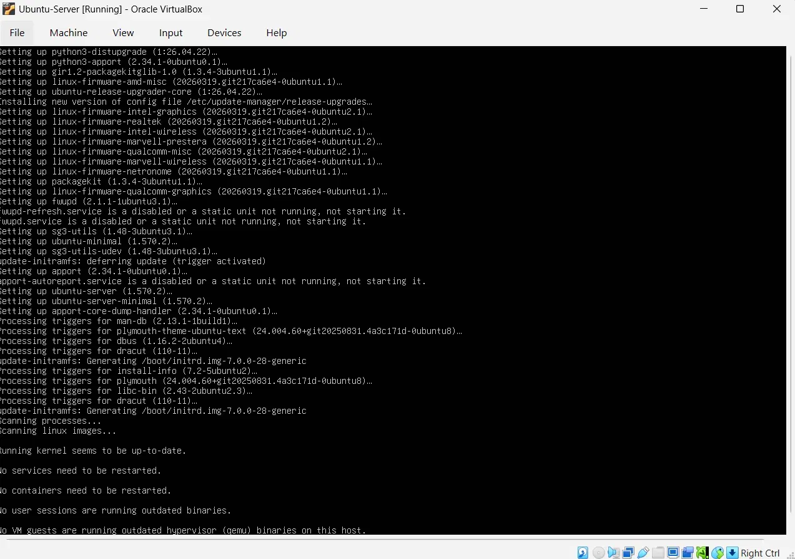
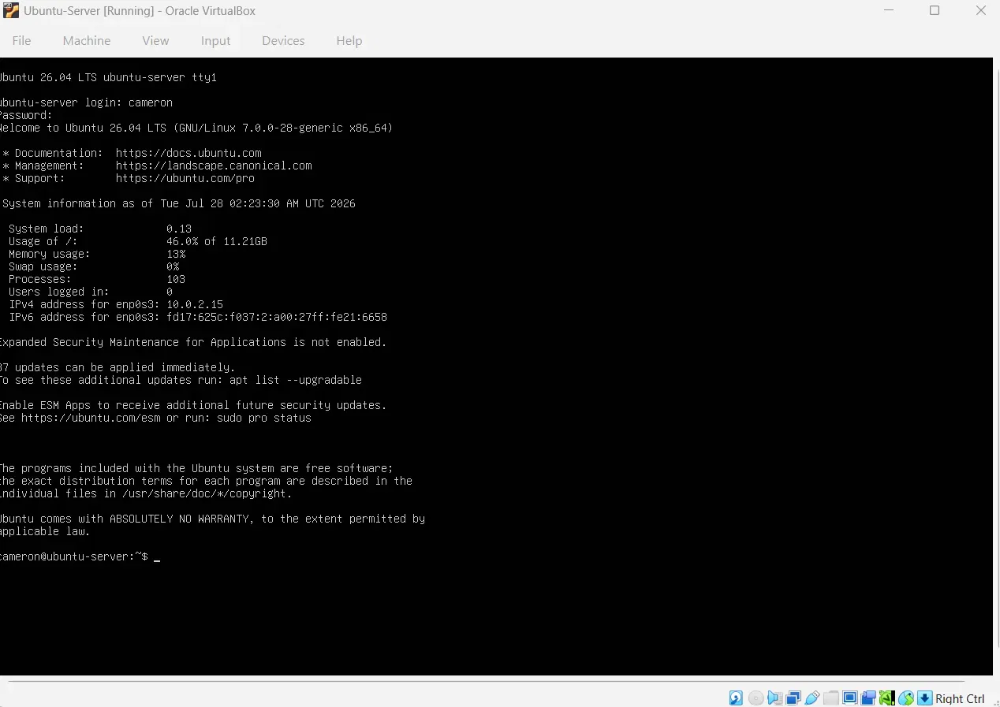
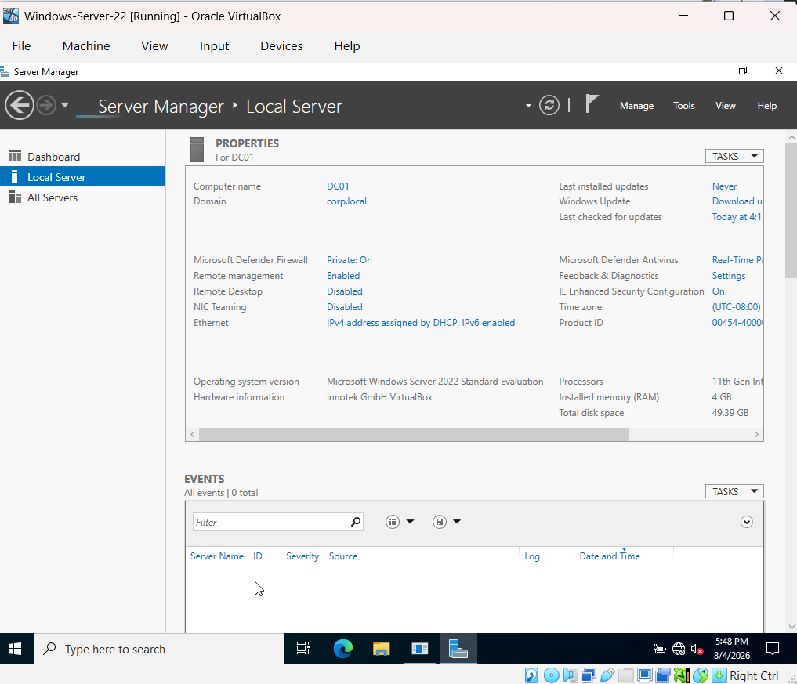
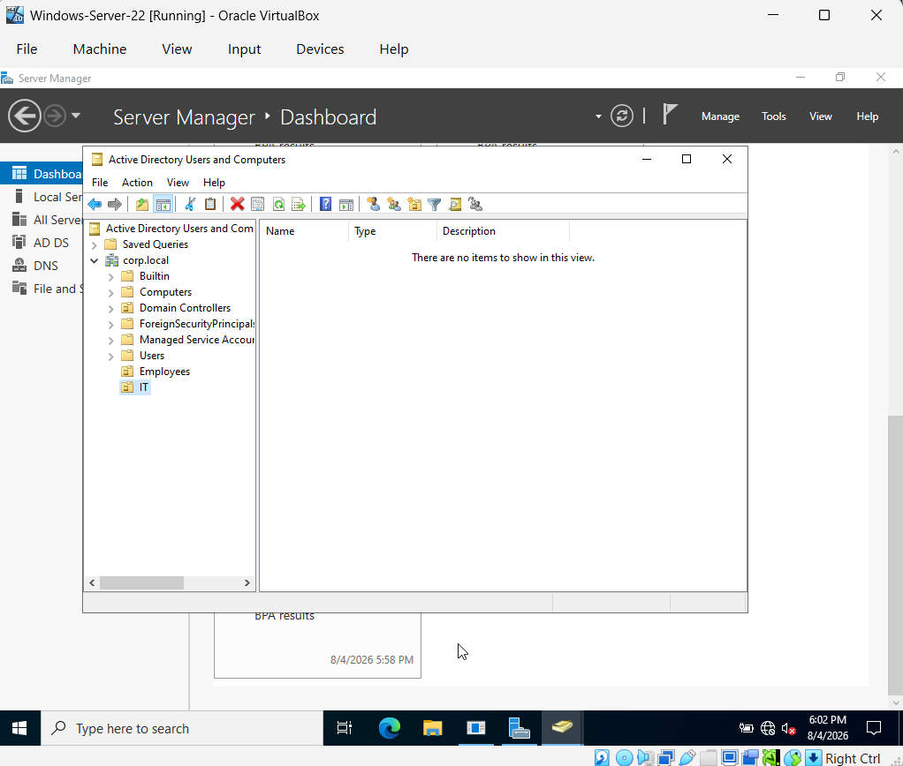
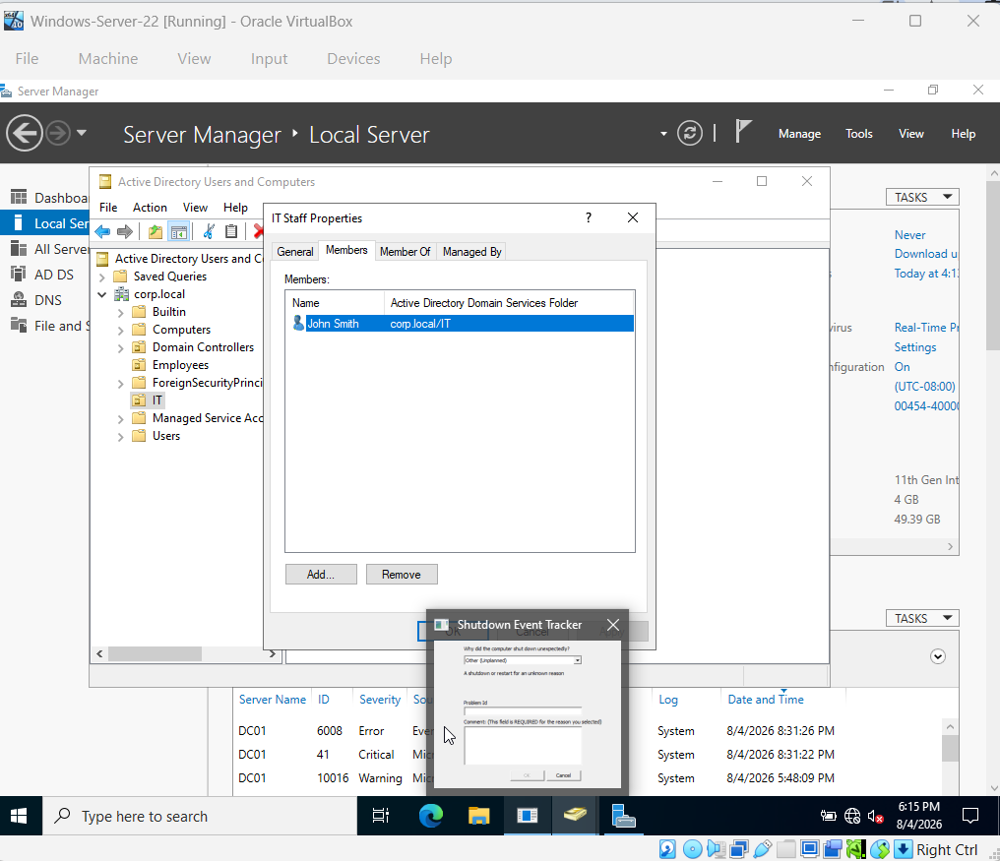
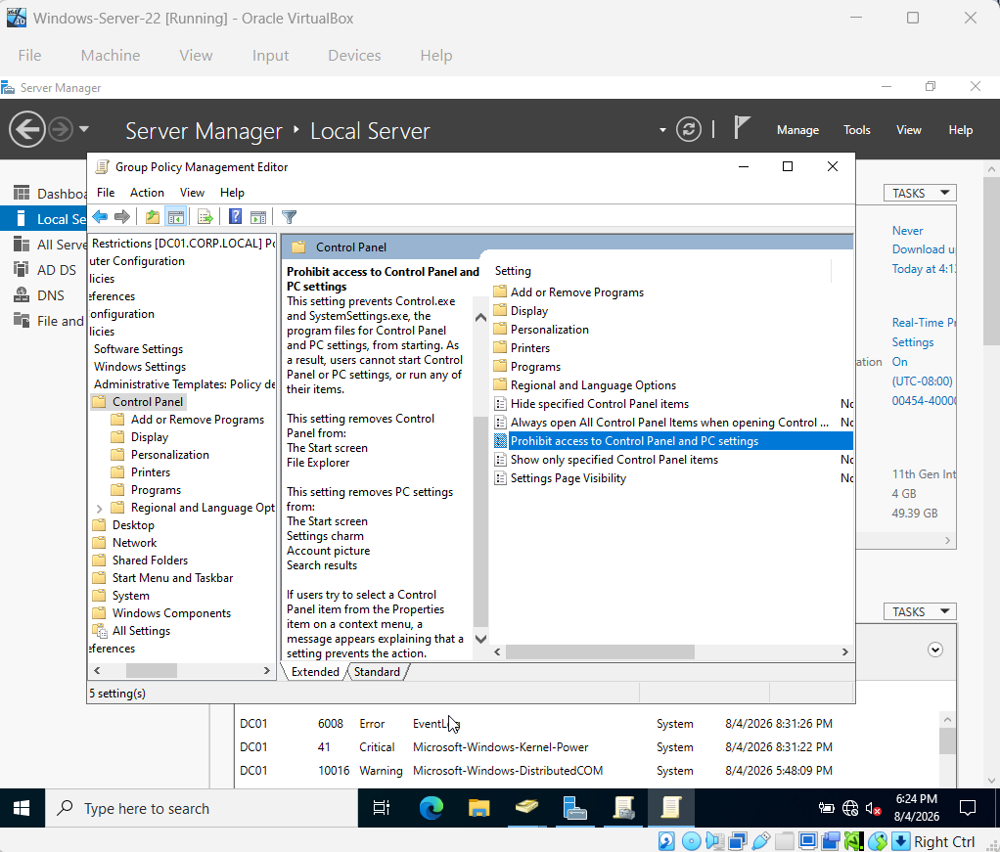

# Cybersecurity Home Lab

## Overview
Personal cybersecurity home lab built on an HP Pavilion x360 (Intel i5, 8GB RAM) running VirtualBox. This is an ongoing project where I'm simulating a small enterprise environment to get hands-on practice and build real skills for help desk and SOC analyst roles.

## Environment
- Host Machine: HP Pavilion x360 (Intel i5-1135G7, 8GB RAM, Windows 11 Home)
- Virtualization Platform: Oracle VirtualBox 7.2
- VM Storage Location: C:\HomeLab (local drive, outside OneDrive)

## Why VirtualBox?
I went with VirtualBox because it's free, open source, and runs well on Windows. It also supports pre-built VM images, which made it the easiest option for a home lab on a personal laptop without spending extra money.

---

## Phase 1: Virtual Machine Setup 

### Overview
The goal of Phase 1 was to get the foundation of my home lab up and running. That meant setting up a virtualization platform and installing two virtual machines, Kali Linux and Ubuntu Server. This gives me multiple systems to work with like a real network, which everything else in the lab builds on.

### Virtual Machines Deployed

**Kali Linux 2026.2**
- **Purpose:** My main machine for security testing and attacks. Kali is the standard pentesting distro and comes with most of the tools I need already installed.
- **RAM Allocated:** 2048 MB
- **Storage:** 80GB virtual disk
- **Configuration:** Imported the pre-built VirtualBox image straight from kali.org
- **Post-install steps:**
  - Updated the system with `sudo apt update && sudo apt upgrade -y`
  - Changed the default password right away for basic security

**Ubuntu Server 26.04 LTS**
- **Purpose:** Simulates a server environment so I can practice Linux administration, networking, and later Active Directory integration.
- **RAM Allocated:** 2048 MB
- **Storage:** 25GB virtual disk
- **Configuration:** Installed from the ISO using the guided storage layout with LVM
- **Post-install steps:**
  - Updated the system with `sudo apt update && sudo apt upgrade -y`
  - Confirmed SSH keys got generated on first boot

### Issues Encountered and Resolved

**Issue 1: Missing Visual C++ Redistributable**
VirtualBox 7.2 needs the Microsoft Visual C++ 2019 Redistributable to run, and the installer failed the first time I tried. Fixed it by downloading the x64 redistributable from Microsoft and running the VirtualBox installer again.

**Issue 2: OneDrive File Locking**
VirtualBox couldn't open the Kali disk image because it was sitting inside my OneDrive synced Documents folder. OneDrive locks large files while syncing, which blocked VirtualBox from getting to them. Moved all my VM files to C:\HomeLab, completely outside OneDrive, and that fixed it.

**Issue 3: Broken VM Registry Reference**
After moving the files, VirtualBox was still pointing to the old location. Removed the broken VM entry and re-imported it straight from C:\HomeLab using File > Open.

**Issue 4: Ubuntu Server Boot Order**
Ubuntu Server tried to boot from the network instead of the ISO the first time. Fixed it in VirtualBox Settings under System by moving the Optical Drive above the Hard Disk so it boots from the ISO first.

### What I Learned
- How virtualization works and how VMs use the host system's resources
- Why it matters to keep VM files outside of cloud synced folders
- Basic Linux administration, including package management and password hardening
- How to troubleshoot common VirtualBox configuration problems

### Screenshots

---

## Phase 2: Active Directory Lab 

### Overview
This phase was about building out a Windows Server domain environment, which is one of the most common setups I'll run into in a real help desk or SOC role. I installed Windows Server 2022, promoted it to a Domain Controller, and set up Organizational Units, users, groups, and Group Policy from scratch.

### What Was Built
- Installed Windows Server 2022 Evaluation and renamed the server to DC01
- Installed the Active Directory Domain Services (AD DS) role
- Promoted DC01 to a Domain Controller, creating the domain corp.local
- Created two Organizational Units: Employees and IT
- Created user accounts: John Smith (IT) and Sarah Johnson (Employees)
- Created a security group called IT Staff and added John Smith as a member
- Created a Group Policy Object called Employee Restrictions and linked it to the Employees OU, configured to prohibit access to Control Panel and PC settings

### Why This Setup
OUs, security groups, and Group Policy are the building blocks of how real companies manage users and computers in Active Directory. Separating Employees from IT mirrors how a real organization would structure permissions, and the Group Policy Object shows how admins push settings out to a whole group of users at once instead of configuring machines one by one.

### Issues Encountered and Resolved

**Issue 5: VM Freeze During Domain Controller Promotion**
The VM froze twice while promoting DC01 to a Domain Controller, both times right after entering the DSRM password and clicking Next. I waited several minutes each time but nothing changed, so I used VirtualBox's Machine > Reset to force a reboot. After the second freeze I figured the VM just didn't have enough resources for this step. I shut it down, bumped the base memory from 2048 MB to 4096 MB, and the promotion went through clean on the next try with no freezing at all.

**Issue 6: VM Freeze During Group Creation**
Had another brief freeze while creating the IT Staff group and adding a member. After resetting, I checked Active Directory Users and Computers and found the group and membership had actually already saved before the freeze hit, so nothing was lost. This told me these freezes are more about the VM catching up on background AD DS work than an actual crash.

**Issue 7: Shutdown Event Tracker Popups**
Every time I had to force a Reset, Windows Server showed a Shutdown Event Tracker prompt asking why it shut down unexpectedly. This is just normal behavior after a hard reset, not an error. I typed a quick note each time, something like "Lab VM reset during AD DS promotion," and moved on.

### What I Learned
- How to install the AD DS role and promote a server to a Domain Controller
- How Organizational Units are used to structure users and computers in a domain
- How to create users and security groups in Active Directory
- How Group Policy Objects get created and linked to specific OUs to apply settings
- That VM freezes during heavier operations like domain promotion are often just a RAM problem, and bumping the allocated memory can fix it completely
- How to recover a frozen VM safely using VirtualBox's Reset function without losing work that already saved

### Screenshots

---

## Phase 3: Splunk SIEM (Coming Soon)

## Phase 4: TryHackMe SOC Level 1 (In Progress)

## Skills Demonstrated
- Virtualization and VM management
- Linux command line basics
- System hardening
- Windows Server administration
- Active Directory Domain Services (AD DS)
- Group Policy configuration
- VM troubleshooting and resource management

## Goals
Building practical skills for help desk and SOC analyst roles in the DMV region.
